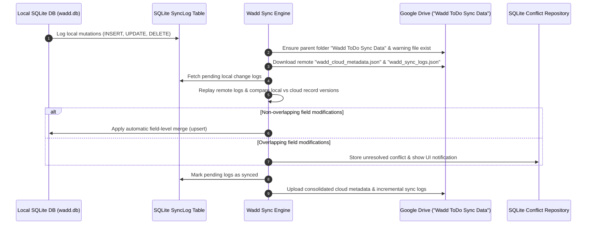
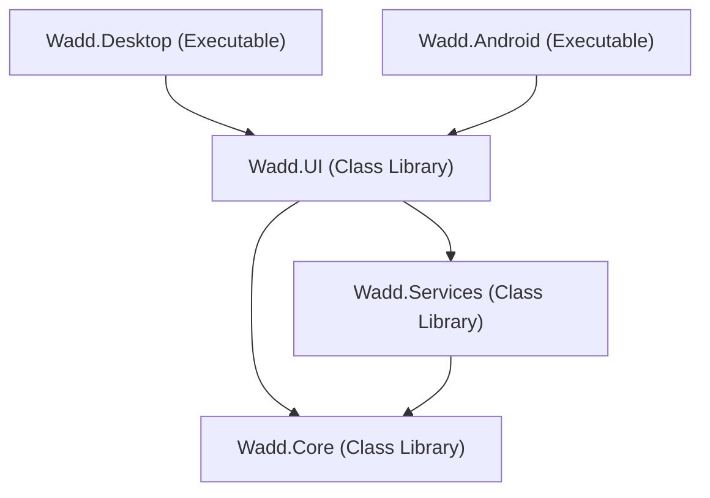

# Wadd - To-Do Application

**Wadd** is a cross-platform To-Do application built with **.NET** and **Avalonia UI**, targeting **Windows** and **Android**. The project architecture strictly adheres to **Clean Architecture** and **MVVM (Model-View-ViewModel)** principles.

---

## 🛠️ Technology Stack

- **Framework**: [.NET 10.0](https://dotnet.microsoft.com/)
- **UI Framework**: [Avalonia UI](https://avaloniaui.net/) (Cross-platform XAML UI toolkit)
- **Theme Package**: [Semi.Avalonia](https://github.com/irihist/Semi.Avalonia) (Modern Control Styling & Design Tokens)
- **MVVM Framework**: [CommunityToolkit.Mvvm](https://learn.microsoft.com/en-us/dotnet/communitytoolkit/mvvm/)
- **Database Engine**: [sqlite-net-pcl](https://github.com/praeclarum/sqlite-net) with [SQLitePCLRaw.bundle_e_sqlite3](https://github.com/ericsink/SQLitePCL.raw) (Embedded SQLite C-Engine)
- **Dependency Injection**: [Microsoft.Extensions.DependencyInjection](https://www.nuget.org/packages/Microsoft.Extensions.DependencyInjection)
- **Language**: C# 12+

---

## 📱 Target Platforms

- **Windows** (Desktop Entry Point: `Wadd.Desktop`)
- **Android** (Mobile Entry Point: `Wadd.Android`)

---

## ✨ Key Features

- **📋 Complete Task Management**: Create, edit, complete, delete, and manage tasks with priority levels (`Low`, `Medium`, `High`, `Critical`), due dates, and custom reminder times.
- **🏷️ Dynamic Storage Mode Status**: User-friendly storage mode indicators in both Task View and Sidebar (`Local Storage Mode` when offline, `Synced with Google Drive` when signed in).
- **⏱️ Real-Time "Last Updated" Freshness**: Live timestamp tracking (`Updated just now`, `Updated 5m ago`, `Updated at 8:40 PM`) auto-updated across mutations and powered by a 30-second background refresh timer.
- **☁️ Google Drive Synchronization**: Seamless 2-way cloud backup and synchronization via Google OAuth 2.0 browser sign-in.
- **📊 Excel Export**: One-click local data export to `.xlsx` spreadsheet format using MiniExcel.
- **🎨 Dynamic Theme Engine**: Smooth Light / Dark mode switching using Semi.Avalonia design tokens.
- **📐 Responsive Dual Layout**: Adaptive responsive UI supporting desktop multi-column view and compact mobile layout.

---

## 💾 Data Architecture

Wadd uses an embedded, local **SQLite** database powered by `sqlite-net-pcl` and `SQLitePCLRaw.bundle_e_sqlite3`.

### 1. Local Database Storage Path
The database file `wadd.db` is stored locally in the platform's local application data folder:
- **Location Path**: `Path.Combine(Environment.GetFolderPath(Environment.SpecialFolder.LocalApplicationData), "Wadd", "wadd.db")`
- **Windows Target**: `%LOCALAPPDATA%\Wadd\wadd.db`
- **Android Target**: `/data/user/0/com.wadd.todoapp/files/Wadd/wadd.db`

### 2. Entity Schema (`TodoItem`)

The `TodoItem` entity is mapped directly to SQLite:

| Property | C# Type | SQLite Column Attributes | Description |
| :--- | :--- | :--- | :--- |
| `Id` | `Guid` | `[PrimaryKey]` | Unique identifier for each To-Do item |
| `Title` | `string` | `NOT NULL` | Task title |
| `Description` | `string` | `NULL` | Optional task description |
| `IsCompleted` | `bool` | `INTEGER` (`0`/`1`) | Completion status |
| `Priority` | `TodoPriority` | `INTEGER` | Priority level (`Low`, `Medium`, `High`, `Critical`) |
| `CreatedAt` | `DateTime` | `DATETIME` | UTC timestamp when item was created |
| `UpdatedAt` | `DateTime?` | `DATETIME` | Optional UTC timestamp of last update |
| `DueDate` | `DateTime?` | `DATETIME` | Optional due date timestamp |
| `ReminderAt` | `DateTime?` | `DATETIME` | Optional reminder date and time timestamp |
| `IsRecurring` | `bool` | `INTEGER` (`0`/`1`) | Recurrence flag |
| `RecurrenceType` | `string` | `TEXT` | Recurrence rule pattern (`None`, `Daily`, `Weekdays`, `Weekly`, `Monthly`, `Yearly`, `Custom`) |
| `CustomRecurrenceInterval` | `int?` | `INTEGER` | Custom recurrence frequency interval (e.g., `2`) |
| `CustomRecurrenceUnit` | `string?` | `TEXT` | Custom recurrence frequency unit (`Days`, `Weeks`, `Months`, `Years`) |
| `CustomWeeklyDays` | `string?` | `TEXT` | Comma-separated selected weekdays when unit is `Weeks` (e.g., `Monday,Wednesday,Friday`) |

### 3. Dependency Injection Architecture

Services and ViewModels are registered using `Microsoft.Extensions.DependencyInjection` via extension methods in `Wadd.Services`:

```csharp
// Service Registration (ServiceCollectionExtensions.cs)
services.AddSingleton<ITodoService, SQLiteTodoService>();
services.AddSingleton<IThemeService, ThemeService>();
services.AddSingleton<ISyncService, SyncService>();
services.AddSingleton<IExportService, ExcelExportService>();
services.AddSingleton<ITracingService, TracingService>();
```

---

## 📊 Export Functionality

Wadd provides local data export capabilities using `ExcelExportService` (implementing `IExportService` in `Wadd.Services`) powered by [MiniExcel](https://github.com/mini-excel/MiniExcel).

### 1. How Excel Exports Work
- **Service API**: `IExportService.ExportToExcelAsync(IEnumerable<TodoItem> items, string filePath, CancellationToken cancellationToken = default)`
- **Column Mapping**: Formats exported items into 5 standardized columns:
  - `ID`: Unique task identifier (`Guid`)
  - `Title`: Task title
  - `Description`: Task description
  - `Status`: Task completion status (`Completed` or `Pending`)
  - `Created Date`: Creation UTC timestamp formatted as `yyyy-MM-dd HH:mm:ss`
- **Platform-Safe Access & Streaming**: Streams data directly to `.xlsx` files with a minimal memory footprint. Missing target directories are automatically created (`Directory.CreateDirectory`) prior to file writing, ensuring safe operation on all target OS platforms.

### 2. Local Storage Output Paths

Export files are saved locally to platform-safe directory locations:

- **Windows Target**:
  - Path: `Path.Combine(Environment.GetFolderPath(Environment.SpecialFolder.LocalApplicationData), "Wadd", "Exports", "todo_export.xlsx")`
  - Resolved Location: `%LOCALAPPDATA%\Wadd\Exports\todo_export.xlsx`
- **Android Target**:
  - Path: `Path.Combine(FileSystem.AppDataDirectory, "Wadd", "Exports", "todo_export.xlsx")`
  - Resolved Location: `/data/user/0/com.wadd.todoapp/files/Wadd/Exports/todo_export.xlsx`

---

## 🔄 Offline-First Multi-Device Synchronization Engine

Wadd features a robust **Offline-First Multi-Device Synchronization Engine** powered by `GoogleDriveSyncService` (implementing `ISyncService` in `Wadd.Services`) with incremental syncing, automatic field-level merging, soft deletes, sync logging, and a dedicated **Conflict Resolution Center UI**.

---

### 1. Architectural Principles & Workflow



---

### 2. Google Drive Folder & File Structure

Sync data is safely isolated in a dedicated parent folder on Google Drive rather than the root directory:

- **Parent Folder Name**: `Wadd ToDo Sync Data` (`application/vnd.google-apps.folder`)
- **Warning File**: `⚠️_WARNING_DO_NOT_DELETE_WADD_SYNC_FOLDER.txt`
  - *Contains instructions warning users not to delete or tamper with the folder.*
- **Cloud Metadata (`wadd_cloud_metadata.json`)**:
  - `latest_revision`: Incremental revision counter.
  - `schema_version`: Data schema version identifier.
  - `last_sync`: Timestamp of last successful synchronization.
  - `registered_devices`: List of all synced devices (`DeviceId`, `DeviceName`, `Platform`, `LastSyncedAt`).
- **Sync Logs (`wadd_sync_logs.json`)**:
  - Incremental list of sync operations across all registered devices.

---

### 3. Database Schema Extensions & New Tables

#### A. Extended `TodoItem` Schema
- `Version` (`long`): Monotonically increasing record version number.
- `IsDeleted` (`bool`): Soft delete indicator (records are soft-deleted to propagate deletions to other devices).

#### B. Sync Log Table (`SyncLog`)
- `Id` (`Guid`): Unique log entry ID.
- `TableName` (`string`): Target table name (`TodoItem`).
- `RecordId` (`Guid`): Target record ID.
- `Operation` (`int`): `0 = Insert`, `1 = Update`, `2 = Delete`.
- `PayloadJson` (`string`): Serialized record JSON payload.
- `Timestamp` (`DateTime`): UTC modification timestamp.
- `DeviceId` (`string`): Originating device ID.
- `Synced` (`bool`): Local sync state flag.
- `Revision` (`long`): Incremental revision index.

#### C. Conflict Table (`SyncConflict`)
- `Id` (`Guid`): Conflict identifier.
- `TableName` (`string`): Affected table name.
- `RecordId` (`Guid`): Affected record ID.
- `LocalVersionJson` (`string`): Serialized local record version.
- `CloudVersionJson` (`string`): Serialized cloud record version.
- `LocalUpdatedAt` (`DateTime`): Local modification timestamp.
- `CloudUpdatedAt` (`DateTime`): Cloud modification timestamp.
- `OriginatingDeviceId` (`string`): Originating device ID.
- `ConflictingFieldsJson` (`string`): List of conflicting field names.
- `Status` (`int`): `0 = Unresolved`, `1 = Resolved`.
- `ResolvedAt` (`DateTime?`): Resolution timestamp.
- `ResolutionType` (`int?`): `0 = KeepLocal`, `1 = KeepCloud`, `2 = ManualMerge`.
- `ResolvedVersionJson` (`string?`): Resulting merged record payload.

---

### 4. Conflict Detection & Task Conflict Dialog Workflow

1. **Automatic Field-Level Merging**:
   - When different devices modify distinct properties of the same task (e.g. Device A edits `Title` while Device B edits `Priority`), Wadd merges both changes automatically without requiring user intervention.
2. **Task Conflict Dialog (`TaskConflictDialog.axaml`)**:
   - If both devices modify the exact same property to conflicting values, Wadd prompts the user for review.
   - **Default Choice Behavior**: **Option 1: Local Device** (`SelectLocalVersion`) is **SELECTED BY DEFAULT** upon opening or navigating to a task index.
   - **Location Context Badges**:
     - `📱 Option 1: Local Device`
     - `☁️ Option 2: Cloud (Google Drive)`
   - **Deletion Alert Boxes**: Highlighted red alert boxes (`"🗑️ Task Deleted Locally"` / `"🗑️ Task Deleted in Cloud"`) display when `IsDeleted == true`.
   - **Active Task Details**: Displays Name, Status (`Completed` / `In Progress`), and Priority (`High` / `Medium` / `Low`).
   - **Navigation**: `[Previous]` and `[Continue]` buttons for smooth conflict navigation.

---

### 5. Setting Up Google OAuth 2.0 Client ID

To connect Wadd to your own Google Cloud project:

1. Open **[Google Cloud Console Credentials](https://console.cloud.google.com/apis/credentials)**.
2. Click **+ CREATE CREDENTIALS** > **OAuth client ID**.
3. Select Application type: **Desktop app** (or **Web application** with Redirect URI `http://localhost:5001/`).
4. Copy your generated **Client ID** (e.g. `1234567890-xyz.apps.googleusercontent.com`).

---

### 3. Configuring `GOOGLE_CLIENT_ID` Environment Variable

You can set the `GOOGLE_CLIENT_ID` environment variable so Wadd loads it automatically without requiring input in the Settings UI:

#### Windows (PowerShell)
```powershell
[System.Environment]::SetEnvironmentVariable("GOOGLE_CLIENT_ID", "YOUR_CLIENT_ID.apps.googleusercontent.com", "User")
```

#### Windows (Command Prompt)
```cmd
setx GOOGLE_CLIENT_ID "YOUR_CLIENT_ID.apps.googleusercontent.com"
```

#### Linux / macOS (`~/.bashrc` or `~/.zshrc`)
```bash
export GOOGLE_CLIENT_ID="YOUR_CLIENT_ID.apps.googleusercontent.com"
```

> [!TIP]
> **In-App Settings UI**:
> Alternatively, you can paste your Client ID directly into Wadd's **Settings** > **CLOUD SYNC** tab. The Client ID will be saved locally in `%LOCALAPPDATA%\Wadd\google_user_auth.json`.

### 3. App Settings Instructions for Endpoint Configuration

To configure Wadd to connect to your deployed Google Apps Script endpoint:

- **Environment Variable**: Set the environment variable `WADD_SYNC_URL`:
  ```bash
  # Windows PowerShell
  $env:WADD_SYNC_URL="https://script.google.com/macros/s/<DEPLOYMENT_ID>/exec"

  # Linux / macOS
  export WADD_SYNC_URL="https://script.google.com/macros/s/<DEPLOYMENT_ID>/exec"
  ```
- **Service Property**: Alternatively, set `GoogleDriveSyncService.WebAppUrl` directly via Dependency Injection in `ServiceCollectionExtensions.cs`.

---

## 📐 Responsive Layout & Dual View Modes

Wadd features an adaptive user interface designed to render smoothly across desktop monitors, mini desktop windows, and mobile Android screens.

### Window Constraints
- **Minimum Width**: `380px`
- **Minimum Height**: `550px`
- **Default Desktop Dimensions**: `1000px x 700px`

### View Modes & Breakpoints

| View Mode | Breakpoint | Navigation Layout | Content Layout |
| :--- | :--- | :--- | :--- |
| **Wide Desktop View** | Width >= `720px` | Fixed 250px Left Navigation Bar | Multi-Column Card Grid with expanded top bar |
| **Portrait Mini View** | Width < `720px` | Bottom Navigation Bar + Collapsible Overlay Drawer | Single-Column Stacked Cards with compact header |

### UI Shell Wireframe Layout Overview

```text
+-------------------------------------------------------------------------------------------------+
|  [Logo] Wadd ToDo [APP]   |  🟢 Local Storage Mode (Saved to local storage · Updated just now)   | ☀️ 🌙 🖥️|
+-------------------------------------------------------------------------------------------------+
| NAVIGATION        | MAIN CONTENT PANEL                                                          |
|                   | +-------------------------------------------------------------------------+ |
| 📋 Tasks          | | Task Management (Local Storage / Cloud Synced)                          | |
| 📊 Calendar (PH)  | | [ Title TextBox                        ]  [ Add Task ]                  | |
| 🔍 Tracing (PH)   | +-------------------------------------------------------------------------+ |
|                   | +-------------------------------------------------------------------------+ |
|                   | | Stored Todo Items                                          [ Reload 🔄 ]| |
|                   | | [x] Buy Groceries                                           [ Delete 🗑️ ]| |
|                   | | [ ] Finish Report                                           [ Delete 🗑️ ]| |
|                   | +-------------------------------------------------------------------------+ |
| ----------------- | +-------------------------------------------------------------------------+ |
| STORAGE & SYNC    | | 🔍 Tracing Area Placeholder (Wireframe Control Box)                     | |
| Local Storage Mode| | [ Trace Logs: Active ]  [ Latency: 0.2ms ]  [ Memory: Safe ]              | |
| Updated just now  | +-------------------------------------------------------------------------+ |
+-------------------------------------------------------------------------------------------------+
```

---

## 🏗️ Project Solution Structure

The solution follows Clean Architecture with clear separation of concerns across 5 dedicated projects:

```text
Wadd/
├── Wadd.sln                           # Solution File
├── README.md                          # Solution Documentation
└── src/
    ├── Wadd.Core/                     # Class Library (Domain Layer)
    │   ├── Enums/                     # Enums (e.g., TodoPriority, ThemeMode)
    │   ├── Models/                    # Domain Models (e.g., TodoItem)
    │   └── Interfaces/                # Core Interfaces
    │       ├── ITodoService.cs        # CRUD operations for Todo items
    │       ├── ISyncService.cs        # Sync engine interface with SyncAsync
    │       ├── IExportService.cs       # Export to Excel interface
    │       ├── ITracingService.cs     # Tracing & telemetry placeholder
    │       └── IThemeService.cs       # Theme management interface
    │
    ├── Wadd.Services/                 # Class Library (Infrastructure Layer)
    │   ├── SQLiteTodoService.cs       # Async SQLite database service implementation
    │   ├── InMemoryTodoService.cs     # Fallback in-memory service
    │   ├── GoogleDriveSyncService.cs  # Google Apps Script HTTP sync engine implementation
    │   ├── SyncService.cs             # Sync engine service alias
    │   ├── ExcelExportService.cs      # MiniExcel local data export implementation
    │   ├── TracingService.cs          # Diagnostics & tracing service
    │   ├── ThemeService.cs            # Dynamic theme switching implementation
    │   └── ServiceCollectionExtensions.cs # Dependency Injection extensions
    │
    ├── Wadd.UI/                       # Class Library (Presentation / Shared UI)
    │   ├── ViewModels/                # MVVM ViewModels (CommunityToolkit.Mvvm)
    │   │   ├── ViewModelBase.cs
    │   │   ├── TodoItemViewModel.cs   # Observable wrapper for TodoItem domain models
    │   │   └── MainViewModel.cs
    │   ├── Views/                     # Shared Avalonia Views & Controls
    │   │   ├── MainView.axaml         # Dual-view responsive layout with live tasks
    │   │   └── MainWindow.axaml       # Min-size constrained desktop window
    │   ├── Styles/                    # Design System & Styling Resources
    │   │   ├── ColorTokens.axaml      # Dynamic Light & Dark Mode palette
    │   │   ├── Typography.axaml       # Cross-platform typography hierarchy
    │   │   └── ComponentStyles.axaml  # Control styles & pseudoclasses
    │   └── App.axaml                  # Avalonia Application, DI & Theme registration
    │
    ├── Wadd.Desktop/                  # Executable (Windows Entry Point)
    │   ├── Program.cs                 # Desktop application entry point
    │   └── Wadd.Desktop.csproj        # Desktop project setup with Avalonia.Desktop
    │
    └── Wadd.Android/                  # Executable (Android Entry Point)
        ├── MainActivity.cs            # Android Activity entry point
        ├── Properties/                # AndroidManifest.xml
        └── Wadd.Android.csproj        # Android project setup with Avalonia.Android
```

### Layer Dependencies



---

## 🎨 Styling & Theme System

Wadd uses a centralized design token architecture registered in `App.axaml`. Theme variants dynamically respond to system preferences or explicit user overrides.

### 1. Dynamic Color Tokens (`ColorTokens.axaml`)

Brushes adapt automatically when `RequestedThemeVariant` switches between `Light` and `Dark`:

| Token Name | Light Mode | Dark Mode | Description |
| :--- | :--- | :--- | :--- |
| `AppBackgroundBrush` | `#F8F9FA` | `#0F172A` | Primary window / view background |
| `AppSurfaceBrush` | `#FFFFFF` | `#1E293B` | Card, sidebar, and header surfaces |
| `AppPrimaryBrush` | `#2563EB` | `#3B82F6` | Primary action color / accents |
| `AppPrimaryHoverBrush` | `#1D4ED8` | `#60A5FA` | Hover state for primary controls |
| `AppTextPrimaryBrush` | `#1E293B` | `#F8FAFC` | High-contrast body & title text |
| `AppTextSecondaryBrush` | `#64748B` | `#94A3B8` | Muted caption & subheader text |
| `AppBorderBrush` | `#E2E8F0` | `#334155` | Dividers and container borders |
| `AppMenuSelectedBrush` | `#EFF6FF` | `#334155` | Selected & hover state in menus |

---

## 🚀 Setup and Build Instructions

### Prerequisites
- [.NET 10.0 SDK](https://dotnet.microsoft.com/download) or higher installed.
- (Optional for Android) .NET Android Workload: Run `dotnet workload restore` or `dotnet workload install android`.

---

### Running `Wadd.Desktop` (Windows Target)

#### 1. Command Line Interface (CLI)
```bash
# Restore & Build Desktop Executable
dotnet build src/Wadd.Desktop/Wadd.Desktop.csproj

# Run Desktop Application Shell
dotnet run --project src/Wadd.Desktop/Wadd.Desktop.csproj
```

#### 2. IDE (Visual Studio / VS Code / JetBrains Rider)
- **Visual Studio**:
  1. Open `Wadd.sln`.
  2. Set `Wadd.Desktop` as the Startup Project in Solution Explorer.
  3. Press `F5` (Start Debugging) or `Ctrl + F5` (Start Without Debugging).
- **VS Code**:
  1. Open workspace folder.
  2. Use C# Dev Kit or press `F5` with .NET Core launch configuration targeting `src/Wadd.Desktop/bin/Debug/net10.0/Wadd.Desktop.dll`.
- **Rider**:
  1. Select `Wadd.Desktop` run configuration.
  2. Click **Run** (`Shift + F10`) or **Debug** (`Shift + F9`).

---

### Running `Wadd.Android` (Mobile Target)

#### 1. Prerequisites Setup
```bash
# Restore required Android workloads
dotnet workload restore
```

#### 2. Command Line Interface (CLI)
```bash
# Build Android APK / Package
dotnet build src/Wadd.Android/Wadd.Android.csproj

# Run / Deploy to connected Android Emulator or Physical Device
dotnet run --project src/Wadd.Android/Wadd.Android.csproj -f net10.0-android
```

#### 3. IDE (Visual Studio / Rider)
- **Visual Studio**:
  1. Set `Wadd.Android` as Startup Project.
  2. Select active Android Emulator or connected physical device from target dropdown.
  3. Press `F5`.
- **Rider**:
  1. Select `Wadd.Android` run configuration and choose target Android device/emulator.
  2. Click **Run** (`Shift + F10`).

---

### Building Solution & Core Libraries

```bash
# Build Core & Service Libraries
dotnet build src/Wadd.Core/Wadd.Core.csproj
dotnet build src/Wadd.Services/Wadd.Services.csproj
dotnet build src/Wadd.UI/Wadd.UI.csproj

# Build Entire Solution
dotnet build Wadd.sln
```