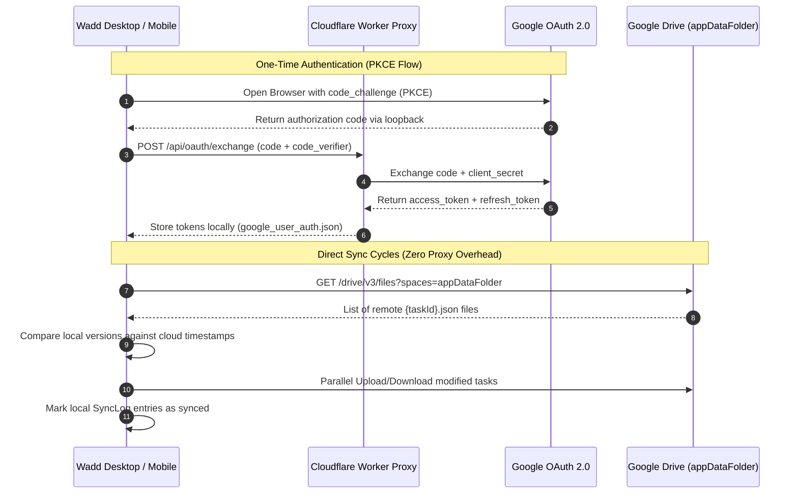

# Wadd: To-Do Application

**Wadd** is a cross-platform To-Do application built with **.NET 10** and **Avalonia UI**, targeting **Windows** and **Android**. The project architecture adheres strictly to **Clean Architecture** and **MVVM (Model-View-ViewModel)** principles.

---

## Technology Stack

- **Framework**: [.NET 10.0](https://dotnet.microsoft.com/)
- **UI Framework**: [Avalonia UI 11.2](https://avaloniaui.net/) (Cross-platform XAML UI toolkit)
- **Theme Package**: [Semi.Avalonia 11.2](https://github.com/irihist/Semi.Avalonia) (Modern control styling and design tokens)
- **MVVM Framework**: [CommunityToolkit.Mvvm 8.4](https://learn.microsoft.com/en-us/dotnet/communitytoolkit/mvvm/)
- **Database Engine**: [sqlite-net-pcl](https://github.com/praeclarum/sqlite-net) with [SQLitePCLRaw.bundle_e_sqlite3](https://github.com/ericsink/SQLitePCL.raw) (Embedded SQLite C-Engine)
- **Spreadsheet Engine**: [MiniExcel](https://github.com/mini-excel/MiniExcel) (Zero-dependency fast XLSX exporter)
- **OAuth Proxy Backend**: [Cloudflare Workers](https://workers.cloudflare.com/) (Serverless OAuth code and token exchange proxy)
- **Dependency Injection**: [Microsoft.Extensions.DependencyInjection](https://www.nuget.org/packages/Microsoft.Extensions.DependencyInjection)
- **Language**: C# 12+

---

## Target Platforms

- **Windows Desktop** (Entry Point: `src/Wadd.Desktop/`)
- **Android Mobile** (Entry Point: `src/Wadd.Android/`)

---

## Key Features

- **Life Goals and Reflection Journal**: Organize long-term vision targets into categories (Health, Career, Finance, Personal) with sequential milestone checklists and record daily reflective journal entries with mood tags. Features dynamic progress calculation `(completed / total) * 100`, soft-deletion tombstones (`IsDeleted`, `DeletedAt`, `UpdatedAt`), and cross-platform desktop/mobile support.
- **AI Goal Coaching and Milestone Breakdown**: Interactive AI assistant powered by `AiGoalService` supporting Google Gemini, OpenAI, Anthropic, OpenRouter, and Custom API endpoints to generate milestone checklists and reflective journal drafts with automatic heuristic fallback.
- **Task Categories and Tags Management**: Assign multi-tag category badges to tasks, filter views dynamically via toolbar category dropdowns, and manage tags globally (create, inline rename, delete) via a dedicated **Tags Management** view.
- **Calendar and Timeline View**: Interactive 42-cell month grid with status indicators, recurring habit occurrence calculations (`RecurrenceEvaluator`), overflow badges (`+X more`), and a toggleable right detail sidebar panel.
- **Google Drive Cloud Sync with Cloudflare OAuth Proxy**: Isolated data synchronization using Google Drive's hidden `appDataFolder` space. Client secrets are secured through a serverless Cloudflare Worker proxy with PKCE code exchange and background token refresh.
- **Conflict Resolution Center**: Automatic field-level merging for non-overlapping edits, with a visual side-by-side conflict resolver dialog for simultaneous edits.
- **Excel Data Export**: Direct streaming export of tasks to `.xlsx` using MiniExcel with zero external Office dependencies.
- **Desktop System Integration**: Windows system tray with minimize-to-tray, single-instance process lock via mutex, native toast notifications with sound chime, and auto-start on Windows boot via Registry.
- **Structured Diagnostics Logging**: In-app live diagnostic log inspector in Settings and daily rolling disk logs stored at `%LOCALAPPDATA%\Wadd\Logs\wadd-YYYY-MM-DD.log`.

---

## Database and Persistence Architecture (SQLite)

All application state is locally persisted in an embedded SQLite database (`wadd.db`) stored under `Environment.SpecialFolder.LocalApplicationData` (`AppDataHelper.GetWaddDirectory()`). All domain models support offline tombstone soft-deletion for local-first sync capabilities.

### Entity Schema Overview

| Entity | Primary Key | Key Fields | Description |
|---|---|---|---|
| `TodoItem` | `Id` (`Guid`) | `Title`, `Description`, `Category`, `IsCompleted`, `Priority`, `DueDate`, `ReminderAt`, `IsRecurring`, `RecurrenceType`, `Version`, `IsDeleted` | Main task item with priority and recurrence |
| `LifeGoal` | `Id` (`string`) | `Title`, `Description`, `Category`, `TargetDate`, `IsAchieved`, `CreatedAt`, `UpdatedAt`, `IsDeleted` | Long-term life vision targets |
| `GoalMilestone` | `Id` (`string`) | `GoalId`, `Title`, `IsCompleted`, `OrderIndex`, `UpdatedAt`, `IsDeleted` | Sequential milestone sub-tasks for goals |
| `JournalEntry` | `Id` (`string`) | `GoalId`, `Title`, `Content`, `Mood`, `EntryDate`, `UpdatedAt`, `IsDeleted` | Daily reflective thoughts and mood history |
| `SyncLog` | `Id` (`Guid`) | `TableName`, `RecordId`, `Operation`, `PayloadJson`, `Timestamp`, `DeviceId`, `Synced`, `Revision` | Local mutation history for cloud replication |
| `SyncConflict` | `Id` (`Guid`) | `TableName`, `RecordId`, `LocalVersionJson`, `CloudVersionJson`, `ConflictingFieldsJson`, `Status`, `ResolutionType` | Unresolved data collision records |

---

## Cloud Sync and OAuth Architecture

Wadd uses an offline-first synchronization architecture connecting to Google Drive through an isolated serverless OAuth proxy.

### 1. Sync Workflow Diagram



### 2. Cloudflare Worker OAuth Proxy

The Cloudflare Worker proxy (`serverless/cloudflare-worker/`) isolates the Google Client Secret from client binaries:

- **Base URL**: `https://wadd-oauth-proxy.djpramono-dev.workers.dev`
- **Endpoints**:
  - `POST /api/oauth/exchange`: Exchanges PKCE authorization code and `code_verifier` for Google access and refresh tokens.
  - `POST /api/oauth/refresh`: Uses stored permanent refresh token to obtain fresh access tokens.
  - `GET /health`: Health check endpoint returning service status.
- **Security**:
  - Client secret (`GOOGLE_CLIENT_SECRET`) is stored securely as an encrypted Cloudflare secret.
  - Supports optional proxy authentication via `APP_PROXY_SECRET` / `X-Proxy-Secret` header.

### 3. Google Drive AppData Storage

Tasks are stored in Google Drive's hidden `appDataFolder` space (`drive.appdata` scope):
- **Private and Isolated**: Files stored in `appDataFolder` are hidden from the user's regular Google Drive files, preventing accidental deletion or clutter.
- **File Format**: Each task is serialized as `{taskId}.json`, allowing fast incremental downloads and parallel updates.
- **Metadata**: Global cloud state is stored in `wadd_cloud_metadata.json`.

---

## AI Goal Coaching and Reflection Engine

The `AiGoalService` provides AI assistance for goal breakdown and journaling:

- **Supported Providers**:
  - Google Gemini (Default)
  - OpenAI (GPT-4o, GPT-4o-mini)
  - Anthropic (Claude 3.5 Sonnet, Claude 3.5 Haiku)
  - OpenRouter (Meta Llama, Mistral, Qwen, etc.)
  - Custom Base URL (Self-hosted or local LLM endpoints)
- **Features**:
  - **Auto-Fill Goal**: Generates comprehensive goal descriptions and target timelines from short titles.
  - **Milestone Generation**: Breaks goals into actionable sequential checklists.
  - **Journal Drafts**: Generates structured reflection drafts based on goal progress and mood tags.
  - **Smart Fallback**: Built-in deterministic heuristic fallback ensures features work offline even without API keys.

---

## Calendar and Timeline Engine

The Calendar view (`src/Wadd.UI/Views/CalendarView.axaml`) provides month-grid scheduling and habit tracking:

- **42-Cell Month Grid**: Responsive 6-week grid rendering day cells, status dots, and habit icons.
- **Recurrence Engine (`RecurrenceEvaluator`)**: Evaluates scheduled tasks and recurring rules (`Daily`, `Weekdays`, `Weekly`, `Monthly`, `Yearly`, `Custom`).
- **Sidebar Inspection**: Selecting any day cell displays a sliding detail panel (`Width="340"`) showing all tasks due on that date with quick toggle and delete actions.

---

## Diagnostics and Application Logging

Wadd includes a centralized diagnostic logging system via `AppLogger`:

- **Disk Log Storage**: Logs are automatically written to `%LOCALAPPDATA%\Wadd\Logs\wadd-YYYY-MM-DD.log`.
- **In-App Inspector**: Open **Settings** > **Diagnostics** to view live logs, copy diagnostic text, or open the log folder directly.
- **Recorded Events**: Unhandled exceptions, sync errors, Google Drive API response codes, notification failures, and startup events.

---

## Project Solution Structure

```text
wadd-todo-app/
├── serverless/
│   └── cloudflare-worker/             # Cloudflare Worker OAuth Proxy
│       ├── src/index.js               # OAuth code exchange and token refresh proxy
│       ├── wrangler.toml              # Worker deployment configuration
│       └── README.md                  # Proxy setup and deployment guide
│
├── src/
│   ├── Wadd.Core/                     # Domain Layer (Class Library)
│   │   ├── Enums/                     # TodoPriority, ThemeMode, RecurrenceType
│   │   ├── Models/                    # TodoItem, LifeGoal, GoalMilestone, JournalEntry
│   │   ├── Logging/                   # AppLogger structured logging engine
│   │   ├── Helpers/                   # AppDataHelper, AppSettingsHelper, RecurrenceEvaluator
│   │   └── Interfaces/                # ITodoService, ISyncService, IAiGoalService, etc.
│   │
│   ├── Wadd.Services/                 # Infrastructure Layer (Class Library)
│   │   ├── SQLiteTodoService.cs       # Async SQLite database implementation
│   │   ├── GoogleDriveSyncService.cs  # Google Drive appDataFolder sync and PKCE OAuth
│   │   ├── AiGoalService.cs           # Multi-provider AI goal assistant
│   │   ├── ExcelExportService.cs      # MiniExcel XLSX streaming exporter
│   │   ├── WindowsNotificationService.cs # Windows native toast notifications
│   │   ├── WindowsStartupService.cs   # Windows Registry startup management
│   │   └── ServiceCollectionExtensions.cs # Dependency injection registration
│   │
│   ├── Wadd.UI/                       # Presentation Layer (Avalonia XAML Shared UI)
│   │   ├── ViewModels/                # MainViewModel, GoalsViewModel, SettingsViewModel
│   │   ├── Views/                     # TasksView, GoalsView, CalendarView, SettingsView
│   │   ├── Styles/                    # Semi.Avalonia styling tokens, typography, colors
│   │   └── App.axaml                  # Application lifetime and resource dictionaries
│   │
│   ├── Wadd.Desktop/                  # Windows Desktop Executable Entry Point
│   │   ├── Program.cs                 # Mutex lock, bring-to-front IPC, startup lifecycle
│   │   └── Wadd.Desktop.csproj
│   │
│   └── Wadd.Android/                  # Android Mobile Executable Entry Point
│       ├── MainActivity.cs            # Android activity lifecycle
│       └── Wadd.Android.csproj
│
└── tests/
    └── Wadd.Tests/                    # Unit Tests (xUnit + FluentAssertions)
        ├── SQLiteTodoServiceTests.cs
        ├── GoogleOAuthSyncTests.cs
        ├── GoalsAndJournalTests.cs
        └── RecurrenceEvaluatorTests.cs
```

---

## Configuration and Environment Variables

Configuration values can be set via a `.env` file in the project root or system environment variables:

| Variable | Default Value | Description |
|---|---|---|
| `GOOGLE_CLIENT_ID` | Built-in Client ID | Google OAuth 2.0 Client ID |
| `OAUTH_PROXY_URL` | `https://wadd-oauth-proxy.djpramono-dev.workers.dev/api/oauth/exchange` | Cloudflare Worker OAuth exchange endpoint |
| `OAUTH_PROXY_SECRET` | *(Optional)* | Header secret for proxy authorization (`X-Proxy-Secret`) |
| `GEMINI_API_KEY` | *(Optional)* | Google Gemini API key for AI features |
| `OPENAI_API_KEY` | *(Optional)* | OpenAI API key |
| `ANTHROPIC_API_KEY` | *(Optional)* | Anthropic API key |
| `OPENROUTER_API_KEY` | *(Optional)* | OpenRouter API key |

---

## Build and Run Instructions

### Prerequisites
- [.NET 10.0 SDK](https://dotnet.microsoft.com/download) or higher installed.

### 1. Running the Windows Desktop App

```powershell
# Run in Debug mode
dotnet run --project src/Wadd.Desktop/Wadd.Desktop.csproj

# Run in optimized Release mode
dotnet run -c Release --project src/Wadd.Desktop/Wadd.Desktop.csproj
```

### 2. Running Automated Unit Tests

```powershell
dotnet test tests/Wadd.Tests/Wadd.Tests.csproj
```

### 3. Deploying the Cloudflare Worker OAuth Proxy

```powershell
cd serverless/cloudflare-worker
npx wrangler deploy
npx wrangler secret put GOOGLE_CLIENT_SECRET
```