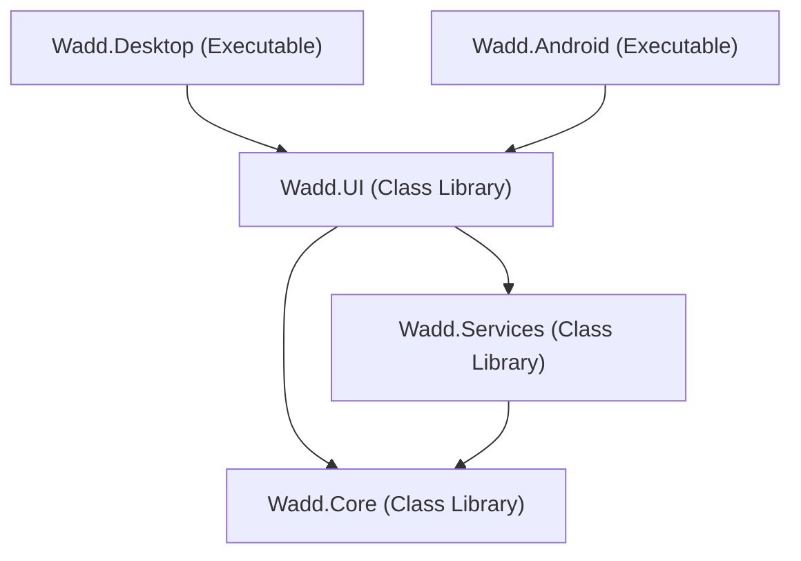

# Wadd - To-Do Application

**Wadd** is a cross-platform To-Do application built with **.NET** and **Avalonia UI**, targeting **Windows** and **Android**. The project architecture strictly adheres to **Clean Architecture** and **MVVM (Model-View-ViewModel)** principles.

---

## 🛠️ Technology Stack

- **Framework**: [.NET 10.0](https://dotnet.microsoft.com/)
- **UI Framework**: [Avalonia UI](https://avaloniaui.net/) (Cross-platform XAML UI toolkit)
- **Theme Package**: [Semi.Avalonia](https://github.com/irihist/Semi.Avalonia) (Modern Control Styling & Design Tokens)
- **MVVM Framework**: [CommunityToolkit.Mvvm](https://learn.microsoft.com/en-us/dotnet/communitytoolkit/mvvm/)
- **Database Engine**: [sqlite-net-pcl](https://github.com/praeclarum/sqlite-net) with [SQLitePCLRaw.bundle_e_sqlite3](https://github.com/ericsink/SQLitePCL.raw) (Embedded SQLite C-Engine)
- **Dependency Injection**: [Microsoft.Extensions.DependencyInjection](https://www.nuget.org/packages/Microsoft.Extensions.DependencyInjection)
- **Language**: C# 12+

---

## 📱 Target Platforms

- **Windows** (Desktop Entry Point: `Wadd.Desktop`)
- **Android** (Mobile Entry Point: `Wadd.Android`)

---

## 💾 Data Architecture

Wadd uses an embedded, local **SQLite** database powered by `sqlite-net-pcl` and `SQLitePCLRaw.bundle_e_sqlite3`.

### 1. Local Database Storage Path
The database file `wadd.db` is stored locally in the platform's local application data folder:
- **Location Path**: `Path.Combine(Environment.GetFolderPath(Environment.SpecialFolder.LocalApplicationData), "Wadd", "wadd.db")`
- **Windows Target**: `%LOCALAPPDATA%\Wadd\wadd.db`
- **Android Target**: `/data/user/0/com.wadd.todoapp/files/Wadd/wadd.db`

### 2. Entity Schema (`TodoItem`)

The `TodoItem` entity is mapped directly to SQLite:

| Property | C# Type | SQLite Column Attributes | Description |
| :--- | :--- | :--- | :--- |
| `Id` | `Guid` | `[PrimaryKey]` | Unique identifier for each To-Do item |
| `Title` | `string` | `NOT NULL` | Task title |
| `Description` | `string` | `NULL` | Optional task description |
| `IsCompleted` | `bool` | `INTEGER` (`0`/`1`) | Completion status |
| `Priority` | `TodoPriority` | `INTEGER` | Priority level (`Low`, `Medium`, `High`, `Critical`) |
| `CreatedAt` | `DateTime` | `DATETIME` | UTC timestamp when item was created |
| `UpdatedAt` | `DateTime?` | `DATETIME` | Optional UTC timestamp of last update |
| `DueDate` | `DateTime?` | `DATETIME` | Optional due date timestamp |

### 3. Dependency Injection Architecture

Services and ViewModels are registered using `Microsoft.Extensions.DependencyInjection` via extension methods in `Wadd.Services`:

```csharp
// Service Registration (ServiceCollectionExtensions.cs)
services.AddSingleton<ITodoService, SQLiteTodoService>();
services.AddSingleton<IThemeService, ThemeService>();
services.AddSingleton<ISyncService, SyncService>();
services.AddSingleton<IExportService, ExportService>();
services.AddSingleton<ITracingService, TracingService>();
```

---

## 📐 Responsive Layout & Dual View Modes

Wadd features an adaptive user interface designed to render smoothly across desktop monitors, mini desktop windows, and mobile Android screens.

### Window Constraints
- **Minimum Width**: `380px`
- **Minimum Height**: `550px`
- **Default Desktop Dimensions**: `1000px x 700px`

### View Modes & Breakpoints

| View Mode | Breakpoint | Navigation Layout | Content Layout |
| :--- | :--- | :--- | :--- |
| **Wide Desktop View** | Width >= `720px` | Fixed 240px Left Navigation Bar | Multi-Column Card Grid with expanded top bar |
| **Portrait Mini View** | Width < `720px` | Bottom Navigation Bar + Collapsible Overlay Drawer | Single-Column Stacked Cards with compact header |

---

## 🏗️ Project Solution Structure

The solution follows Clean Architecture with clear separation of concerns across 5 dedicated projects:

```text
Wadd/
├── Wadd.sln                           # Solution File
├── README.md                          # Solution Documentation
└── src/
    ├── Wadd.Core/                     # Class Library (Domain Layer)
    │   ├── Enums/                     # Enums (e.g., TodoPriority, ThemeMode)
    │   ├── Models/                    # Domain Models (e.g., TodoItem)
    │   └── Interfaces/                # Core Interfaces
    │       ├── ITodoService.cs        # CRUD operations for Todo items
    │       ├── ISyncService.cs        # Sync engine interface with SyncAsync
    │       ├── IExportService.cs       # Export to Excel interface
    │       ├── ITracingService.cs     # Tracing & telemetry placeholder
    │       └── IThemeService.cs       # Theme management interface
    │
    ├── Wadd.Services/                 # Class Library (Infrastructure Layer)
    │   ├── SQLiteTodoService.cs       # Async SQLite database service implementation
    │   ├── InMemoryTodoService.cs     # Fallback in-memory service
    │   ├── SyncService.cs             # Remote sync engine service
    │   ├── ExportService.cs           # Excel export service implementation
    │   ├── TracingService.cs          # Diagnostics & tracing service
    │   ├── ThemeService.cs            # Dynamic theme switching implementation
    │   └── ServiceCollectionExtensions.cs # Dependency Injection extensions
    │
    ├── Wadd.UI/                       # Class Library (Presentation / Shared UI)
    │   ├── ViewModels/                # MVVM ViewModels (CommunityToolkit.Mvvm)
    │   │   ├── ViewModelBase.cs
    │   │   └── MainViewModel.cs
    │   ├── Views/                     # Shared Avalonia Views & Controls
    │   │   ├── MainView.axaml         # Dual-view responsive layout with live tasks
    │   │   └── MainWindow.axaml       # Min-size constrained desktop window
    │   ├── Styles/                    # Design System & Styling Resources
    │   │   ├── ColorTokens.axaml      # Dynamic Light & Dark Mode palette
    │   │   ├── Typography.axaml       # Cross-platform typography hierarchy
    │   │   └── ComponentStyles.axaml  # Control styles & pseudoclasses
    │   └── App.axaml                  # Avalonia Application, DI & Theme registration
    │
    ├── Wadd.Desktop/                  # Executable (Windows Entry Point)
    │   ├── Program.cs                 # Desktop application entry point
    │   └── Wadd.Desktop.csproj        # Desktop project setup with Avalonia.Desktop
    │
    └── Wadd.Android/                  # Executable (Android Entry Point)
        ├── MainActivity.cs            # Android Activity entry point
        ├── Properties/                # AndroidManifest.xml
        └── Wadd.Android.csproj        # Android project setup with Avalonia.Android
```

### Layer Dependencies



---

## 🎨 Styling & Theme System

Wadd uses a centralized design token architecture registered in `App.axaml`. Theme variants dynamically respond to system preferences or explicit user overrides.

### 1. Dynamic Color Tokens (`ColorTokens.axaml`)

Brushes adapt automatically when `RequestedThemeVariant` switches between `Light` and `Dark`:

| Token Name | Light Mode | Dark Mode | Description |
| :--- | :--- | :--- | :--- |
| `AppBackgroundBrush` | `#F8F9FA` | `#0F172A` | Primary window / view background |
| `AppSurfaceBrush` | `#FFFFFF` | `#1E293B` | Card, sidebar, and header surfaces |
| `AppPrimaryBrush` | `#2563EB` | `#3B82F6` | Primary action color / accents |
| `AppPrimaryHoverBrush` | `#1D4ED8` | `#60A5FA` | Hover state for primary controls |
| `AppTextPrimaryBrush` | `#1E293B` | `#F8FAFC` | High-contrast body & title text |
| `AppTextSecondaryBrush` | `#64748B` | `#94A3B8` | Muted caption & subheader text |
| `AppBorderBrush` | `#E2E8F0` | `#334155` | Dividers and container borders |
| `AppMenuSelectedBrush` | `#EFF6FF` | `#334155` | Selected & hover state in menus |

---

## 🚀 Setup and Build Instructions

### Prerequisites
- [.NET 10.0 SDK](https://dotnet.microsoft.com/download) or higher installed.
- (Optional for Android) .NET Android Workload: Run `dotnet workload install android`.

### Restore and Build

#### Build Desktop (Windows)
```bash
dotnet build src/Wadd.Desktop/Wadd.Desktop.csproj
```

#### Run Desktop Application
```bash
dotnet run --project src/Wadd.Desktop/Wadd.Desktop.csproj
```

#### Build Core Libraries & Services
```bash
dotnet build src/Wadd.Core/Wadd.Core.csproj
dotnet build src/Wadd.Services/Wadd.Services.csproj
dotnet build src/Wadd.UI/Wadd.UI.csproj
```

#### Build Android Application
First ensure Android workloads are restored:
```bash
dotnet workload restore
dotnet build src/Wadd.Android/Wadd.Android.csproj
```

#### Build Entire Solution
```bash
dotnet build Wadd.sln
```